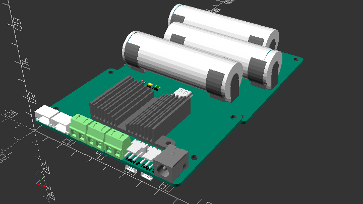

# OpenUPS

A universal and versatile high power SBC UPS

## Introduction

**This is a work in progress repository**

More up-to-date information available on Odroid forum: 

License:



### Install
```
  git clone https://github.com/tomek-szczesny/OpenUPS.git

```

### OpenUPS Features:
-  Multi SBC support
-  Variable Input Voltage 7v-24v
-  Multiple Output Voltage 5v, 12v, Vin mirrored
-  Dual SATA power ports
-  Dual 12v Fan ports
-  Expanable 3S1P Battery Capacity
-  21700 and 18650 Battery Support
-  I2C Power, Temperature and Battery Status Reporting
-  Custom Cases
   - Drive Bay Case Mount
   - Standalone Case
-  Easy Battery Maintenance

### Base Case Designs:
- Shell - complete
- Panel - complete
- Stacked - complete
[Open source UPS design - ODROID](https://forum.odroid.com/viewtopic.php?f=55&t=46481)
