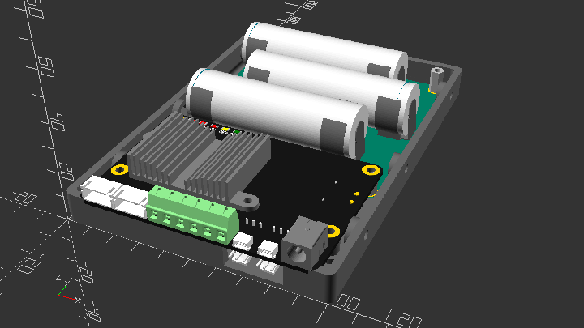
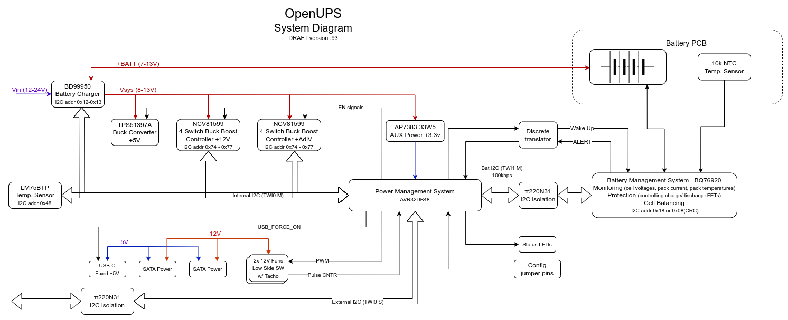

# OpenUPS

A universal and versatile high power SBC UPS

## Introduction

**This is a work in progress repository**

More up-to-date information available on Odroid forum:

[Open source UPS design - ODROID](https://forum.odroid.com/viewtopic.php?f=55&t=46481)

License:



### Install
```
  git clone https://github.com/tomek-szczesny/OpenUPS.git

```

### OpenUPS Features:
-  Multi SBC support
-  Wide Input Voltage Range: 12V - 24V
-  Multiple Output Voltages: 5V, 12V, Programmable (0-24V) or Vin repeater,
-  Dual SATA power ports, supports 3.5" HDDs as well,
-  Dual 12V Fan ports with PWM control and RPM monitoring,
-  I2C Configuration and Reporting, incl. Battery Voltage, Current
-  3D-printable Custom Cases
   - Drive Bay Case Mount
   - Standalone Case
-  Expandable 3S1P Battery Capacity
-  18650, 20700 or 21700 Cell Support
-  Easy Battery Maintenance



